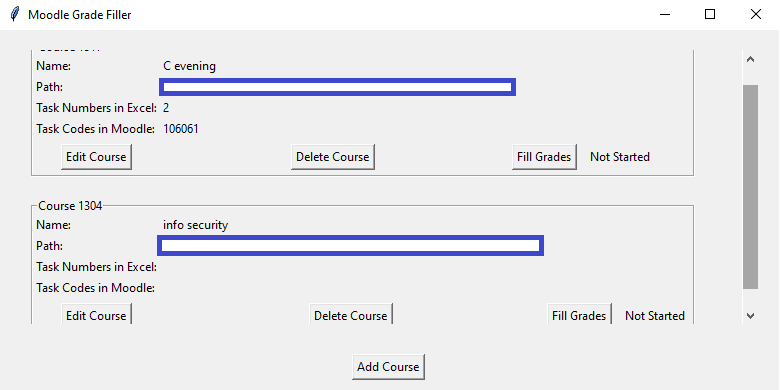

**Moodle Grade Filler**

The Moodle Grade Filler is a Python application that automates grade entry into the Moodle LMS using Selenium and provides a GUI for course and task management with Tkinter.

**Tech Stack:**

- **Python**
- **GUI**: Tkinter
- **Web Automation**: Selenium
- **Database**: SQLite
- **Multi-threading**: threading module
- **Version Control**: Git (GitHub)

**Features:**

- Add, edit, and delete courses and tasks.
- Automate grade entry into Moodle.
- Real-time status updates.
- Persistent data storage with SQLite.

**Usage:**
- Clone the repo, create a virtal enviorment and install the dependecies.
- Run the app: ```python gui.py```
- Add courses and tasks.

**Notes**
- The application expects the grades file to be a .xlsx or .numbers format.
- The first column of the grades file should be ```students```. Each task should be named: ```ex{number},``` and comments ```ex{number}_comments```.


